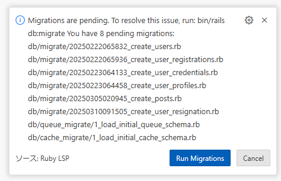
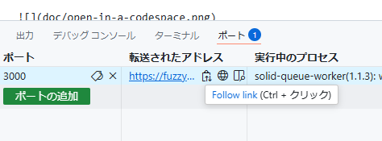

# ActiveRecordCompose Example Application

ActiveRecordCompose Example は Template repository であり、そのまま codespace で開発環境を開くことができます。
https://github.com/hamajyotan/active_record_compose-example から `Use this template` > `Open in a codespace` により codespace をそのまま開くことができます。

codespace を起動してしばらくすると、コンソールでセットアップが完了することが確認できます。

なお、起動処理の途中 ruby-lsp により migration が未実施であることが通知されますがこれは一時的なものです。
セットアッププロセス `bin/setup` の中でこの問題は解決されるのでそのまま応答しなくても問題ありません。
(また、ダイアログ表示時点で `Run Migrations` を応答しても悪影響はありません)

セットアップの最後に、コンソールから通常の Rails アプリケーションとして `bin/rails server` コマンドが実行され起動します。

自動的にブラウザが開き、そこでアプリケーションの動作が確認できます。

再びブラウザで開くには、`転送されたアドレス` にある URL から確認できます。

基本的には codespace は自動削除されますが、気になる場合は直接 https://github.com/codespaces から削除することができます。

