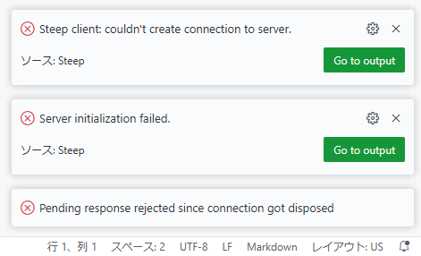
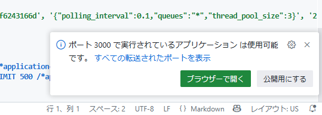
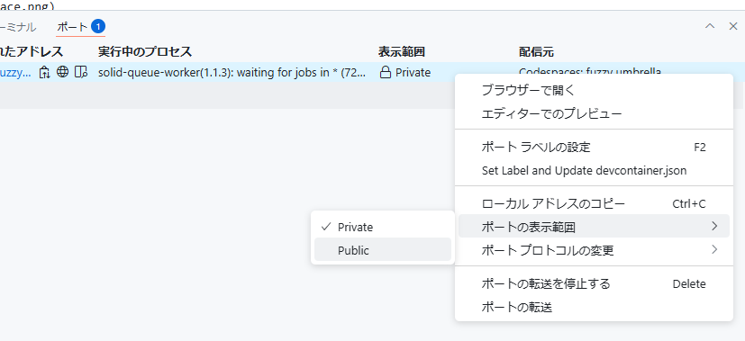

# ActiveRecordCompose Example Application

以下のリンクから GitHub Codespaces で開けます

リンク押下後、 `Create new codespace` から起動できます。

codespace を起動してしばらくすると、コンソールでセットアップが完了することが確認できます。

なお、起動処理の途中 steep エクステンションの初期化でエラーが生じたり、 ruby-lsp により migration が未実施であることが通知されますがこれは一時的なものです。
セットアッププロセス `bin/setup` の中でこの問題は解決されるのでそのまま応答しなくても問題ありません。
(また、ダイアログ表示時点で `Run Migrations` を応答しても悪影響はありません)

コンソールから通常の Rails アプリケーションとして `bin/rails s` コマンドで起動できます。

起動すると、 3000番ポートを公開するか否かを問われるダイアログが表示されます。
この時点ではセキュリティのためにポートは外部解放されていませんが、`公開用にする` を応答すると、ポートを公開することになりアクセス可能になります。

ダイアログへの応答できなかった場合は以下の手順でポートを公開します。
`ポート` > `表示範囲` から `Private` に設定されている箇所でメニューを開き、 `ポートの表示範囲` > `Public` に変更します。

`転送されたアドレス` にある URL からアプリケーションの動作を確認できます。

別のウィンドウからリンク先をひらくと、はじめの1回は警告表示されます。 `Continue` を応答します。

`Continue` 応答後、アプリケーションの動作が確認できます。

基本的には codespace は自動削除されますが、気になる場合は直接 https://github.com/codespaces から削除することができます。

