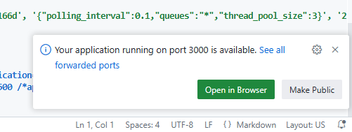
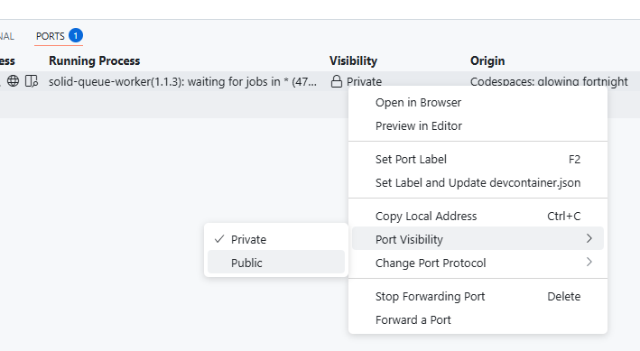
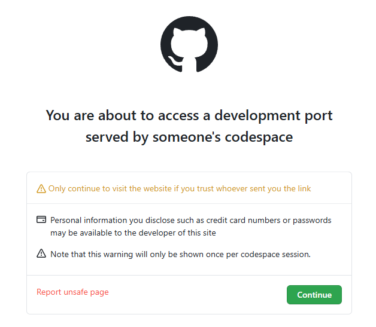

# ActiveRecordCompose Example Application

you can open it from the following link:

After clicking the link, you can start it from `Create new codespace`.

After starting the Codespace, you will see a confirmation in the console once the setup is complete.

During the startup process, you may temporarily encounter errors during the initialization of the Steep extension or receive notifications from ruby-lsp indicating that migrations have not been performed. However, this is only a temporary issue.
This issue will be resolved as part of the setup process (`bin/setup`), so you can safely ignore it.
(Additionally, responding with `Run Migrations` when the dialog appears will not cause any problems.)

From the console, you can start the application as a normal Rails app using the `bin/rails s` command.

When launching, a dialog will appear asking whether to expose port 3000.
At this point, the port is not accessible externally for security reasons. However, if you select `Make Public`, the port will be exposed and accessible.

If you were unable to respond to the dialog, you can manually expose the port by following these steps:
Go to `PORTS` > `Visibility`, open the menu where it is set to `Private`, and change `Port Visibility` to `Public`.

You can now access the application from the `Forwarded Address` URL.

When opening the link in a new window for the first time, a warning message will appear. Click `Continue` to proceed.

After clicking `Continue`, you should see the application running successfully.

By default, the codespace is automatically deleted, but if needed, you can manually delete it from https://github.com/codespaces .

