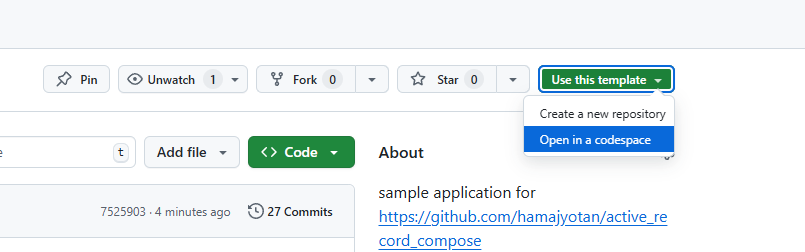
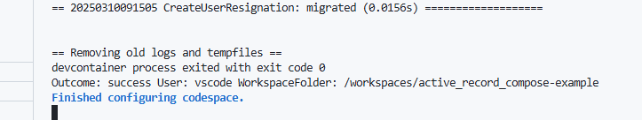
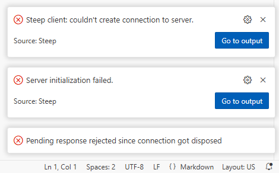
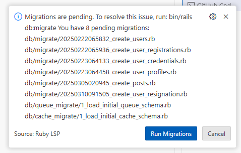
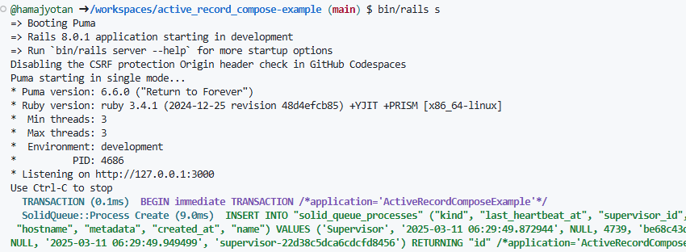
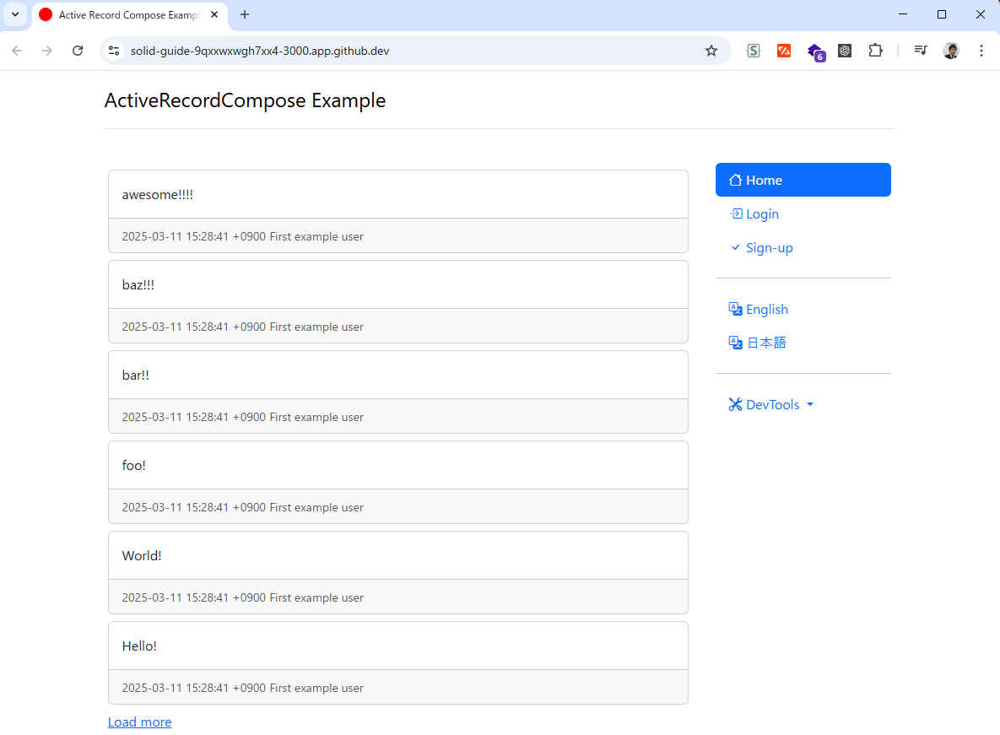
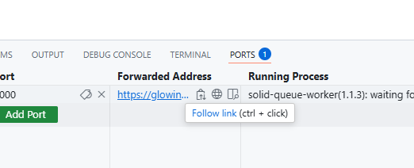
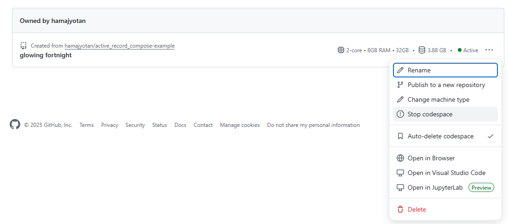

# ActiveRecordCompose Example Application

ActiveRecordCompose Example is a template repository, allowing you to open a development environment in Codespaces as is.  
You can open a Codespace directly by navigating to https://github.com/hamajyotan/active_record_compose-example and selecting `Use this template` > `Open in a codespace`.

After starting the Codespace, you will see a confirmation in the console once the setup is complete.

During the startup process, you may temporarily encounter errors during the initialization of the Steep extension or receive notifications from ruby-lsp indicating that migrations have not been performed. However, this is only a temporary issue.
This issue will be resolved as part of the setup process (`bin/setup`), so you can safely ignore it.
(Additionally, responding with `Run Migrations` when the dialog appears will not cause any problems.)

At the end of the setup, the `bin/rails server` command is run from the console to start the application as a regular Rails app.

A browser will automatically open, allowing you to verify that the application is running properly.

To open it in the browser again, you can access it via the URL shown in the `Forwarded Address`.

By default, the codespace is automatically deleted, but if needed, you can manually delete it from https://github.com/codespaces .

