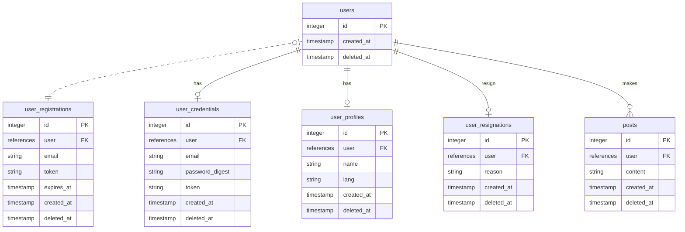

# ActiveRecordCompose Example Application

このリポジトリは gem [active_record_compopse](https://github.com/hamajyotan/active_record_compose) を使ったサンプルアプリケーションです。

- [README (engligh)](README.md)
- [README (japanense)](README.ja.md)

簡易的なマイクロポストアプリケーションです。

- ユーザ登録をするとポストできるようになります
- 無条件に、他者のポストも参照できます
- ユーザ間のフォロー機能などはありません
- なお、 development では実際のメール送信はしません。 [letter_opener_web](https://rubygems.org/gems/letter_opener_web) でメール送信を模倣しています。

# 起動方法

一般的な Rails アプリケーションなので `bin/setup --skip-server` および `bin/rails s` で起動できます。
vscode devcontainer での起動も可能です。
また、ローカル開発環境でなくとも GitHub Codespaces でも開発環境を動かすことができます。

## codespace で開く

ActiveRecordCompose Example は Template repository であり、そのまま codespace で開発環境を開くことができます。
https://github.com/hamajyotan/active_record_compose-sample から `Use this template` > `Open in a codespace` により codespace をそのまま開くことができます。

codespace で開いた後は [README.codespaces.ja.md](README.codespaces.ja.md) を参照ください。

# プログラムコードについて

`app/models/*` にいくつかのモデル定義が存在しています。
そのなかで、以下のファイルは `ApplicationRecord` をスーパークラスとするモデルです。

- `User`
- `UserCredential`
- `UserProfile`
- `UserRegistration`
- `UserResignation`
- `Post`

`app/models/*` の上記以外のファイルは `ActiveRecordCompose::Model` をスーパークラスとするモデルであり、
gem [active_record_compopse](https://github.com/hamajyotan/active_record_compose) の用例となっています。

## E-R Diagram

