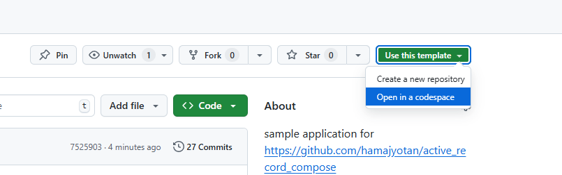

# ActiveRecordCompose Example Application

このリポジトリは gem [active_record_compopse](https://github.com/hamajyotan/active_record_compose) を使ったサンプルアプリケーションです。

- [README (engligh)](README.md)
- [README (japanense)](README.ja.md)

# 起動方法

一般的な Rails アプリケーションなので `bin/setup --skip-server` および `bin/rails s` で起動できます。
vscode devcontainer での起動も可能です。
また、ローカル開発環境でなくとも GitHub Codespaces でも開発環境を動かすことができます。

## codespace で開く

ActiveRecordCompose Example は Template repository であり、そのまま codespace で開発環境を開くことができます。
https://github.com/hamajyotan/active_record_compose-sample から `Use this template` > `Open in a codespace` により codespace をそのまま開くことができます。

codespace で開いた後は [README.codespaces.ja.md](README.codespaces.ja.md) を参照ください。

## E-R Diagram

