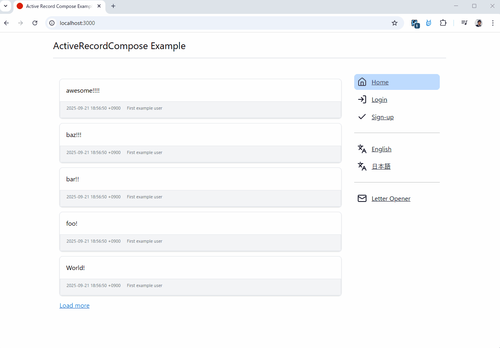

# ActiveRecordCompose Example Application

このリポジトリは gem [active_record_compose](https://github.com/hamajyotan/active_record_compose) を使ったサンプルアプリケーションです。

- [README (English)](README.md)
- [README (日本語)](README.ja.md)

簡易的なマイクロポストアプリケーションです。

- ユーザ登録をするとポストできるようになります
- 無条件に、他者のポストも参照できます
- ユーザ間のフォロー機能などはありません
- なお、 development では実際のメール送信はしません。 [letter_opener_web](https://rubygems.org/gems/letter_opener_web) でメール送信を模倣しており、開発環境に限り `/letter_opener` のパスからアクセスできます。



# 起動方法

一般的な Rails アプリケーションなので `bin/setup --skip-server` および `bin/rails s` で起動できます。
vscode devcontainer での起動も可能です。
また、ローカル開発環境でなくとも GitHub Codespaces でも開発環境を動かすことができます。

## GitHub Codespaces で開く

ActiveRecordCompose Example は Template repository であり、そのまま codespace で開発環境を開くことができます。  
https://github.com/hamajyotan/active_record_compose-example から `Use this template` > `Open in a codespace` により codespace をそのまま開くことができます。


GitHub Codespace で開いた後は [README.codespaces.ja.md](README.codespaces.ja.md) を参照ください。

# プログラムコードについて

`app/models/*` にいくつかのモデル定義が存在しています。
そのなかで、以下のファイルは `ApplicationRecord` をスーパークラスとするモデルです。

- `User`
- `UserCredential`
- `UserProfile`
- `UserRegistration`
- `UserResignation`
- `Post`

`app/models/*` の上記以外のファイルは `ActiveRecordCompose::Model` をスーパークラスとするモデルであり、
gem [active_record_compose](https://github.com/hamajyotan/active_record_compose) の用例となっています。

## ActiveRecordCompose::Model 使用例としての抜粋

例えば以下は `app/models/dashboard/resignation.rb` です。
これはログインしているユーザが、退会処理を実施するためのモデルです。

```ruby
class Dashboard::Resignation < ActiveRecordCompose::Model
  # 初期化引数として User モデルのインスタンスを受け入れます。
  def initialize(user)
    @user = user
    # 退会を意味するモデルである UserResignation のインスタンスを生成し、
    # かつそれを models に push することで Dashboard::Resignation#save 時にそれが保存される準備をしています。
    @user_resignation = user.then { it.user_resignation || it.build_user_resignation }
    models.push(user_resignation)
    # Dashboard::Resignation#save 時に、
    # User が保有する UserProfile および UserCredential を削除対象としています。
    models.push(user_profile, destroy: true)
    models.push(user_credential, destroy: true)
    super()
  end

  # accept は退会確認のチェックを受け入れるための値です。
  # これは永続化されるものではなく、フォームからの都合による属性です。
  attribute :accept, :boolean, default: false
  # UserResignation は reason という属性を有しています。
  # 保存時にこの値を設定できるよう、
  # そしてあたかも Dashboard::Resignation 自体が reason 属性を保有しているかのように透過的アクセスが可能になります。
  delegate_attribute :reason, to: :user_resignation

  # 退会確認のチェックが有効であることをバリデーションで検証しています。
  validates :accept, presence: true

  private

  attr_reader :user, :user_resignation

  delegate :user_profile, :user_credential, to: :user, private: true
end
```

`Dashboard::Resignation#save!` により、各モデルに対するデータ操作がアトミックに実施されます。

```ruby
I18n.locale = :ja
resignation = Dashboard::Resignation.new(user)
resignation.reason = "使いづらいです"
resignation.save          # => false
resignation.errors        # => #<ActiveModel::Errors [#<ActiveModel::Error attribute=accept, type=blank, options={}>]>
resignation.errors.to_a   # => ["チェックを入れてください"]
resignation.accept = true
resignation.save          # => true
                          # BEGIN
                          # DELETE FROM `user_profiles` WHERE `user_id` = 1
                          # DELETE FROM `user_credentials` WHERE `user_id` = 1
                          # INSERT INTO `user_resignations` (`user_id`, `reason`) VALUES (1, "使いづらいです")
                          # COMMIT
```

## E-R Diagram


