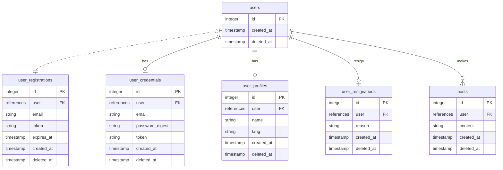

# ActiveRecordCompose Example Application

This repository is a sample application using the gem [active_record_compopse](https://github.com/hamajyotan/active_record_compose).

- [README (engligh)](README.md)
- [README (japanense)](README.ja.md)

This is a simple micropost application.

- Users can post after registering.
- All posts are viewable without restrictions.
- There is no follow function between users.
- In the development environment, actual email sending is not performed. Email sending is simulated using [letter_opener_web](https://rubygems.org/gems/letter_opener_web).

# How to Start

Since this is a standard Rails application, you can start it with `bin/setup --skip-server` and `bin/rails s`.
It can also be launched in a VS Code dev container.
Additionally, you can run the development environment on GitHub Codespaces, not just on your local machine.

## Open in a codespace

ActiveRecordCompose Example is a template repository, allowing you to open a development environment in Codespaces as is.
You can open a Codespace directly by navigating to https://github.com/hamajyotan/active_record_compose-example and selecting `Use this template` > `Open in a codespace`.

After opening in Codespaces, please refer to [README.codespaces.md](README.codespaces.md).

# Regarding the program code:

In the `app/models/*` directory, there are several model definitions.
Among them, the following files are models that inherit from `ApplicationRecord`:

- `User`
- `UserCredential`
- `UserProfile`
- `UserRegistration`
- `UserResignation`
- `Post`

The other files in `app/models/*` are models that inherit from `ActiveRecordCompose::Model`,
serving as examples of using the [active_record_compopse](https://github.com/hamajyotan/active_record_compose) gem.

## E-R Diagram

