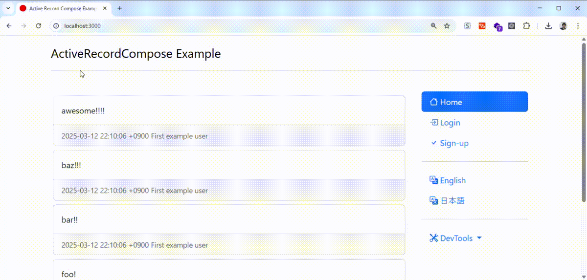
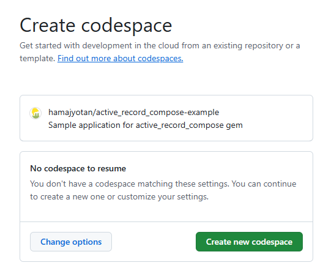
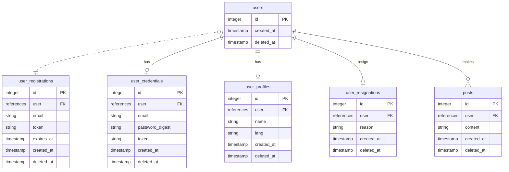

# ActiveRecordCompose Example Application

This repository is a sample application using the gem [active_record_compose](https://github.com/hamajyotan/active_record_compose).

- [README (engligh)](README.md)
- [README (japanense)](README.ja.md)

This is a simple micropost application.

- Users can post after registering.
- All posts are viewable without restrictions.
- There is no follow function between users.
- In the development environment, actual email sending is not performed. Email sending is simulated using [letter_opener_web](https://rubygems.org/gems/letter_opener_web).



# How to Start

Since this is a standard Rails application, you can start it with `bin/setup --skip-server` and `bin/rails s`.
It can also be launched in a VS Code dev container.
Additionally, you can run the development environment on GitHub Codespaces, not just on your local machine.

## Open in a GitHub Codespaces

you can open it from the following link:

[](https://codespaces.new/hamajyotan/active_record_compose-example)

After clicking the link, you can start it from `Create new codespace`.



After opening in GitHub Codespaces, please refer to [README.codespaces.md](README.codespaces.md).

# Regarding the program code:

In the `app/models/*` directory, there are several model definitions.
Among them, the following files are models that inherit from `ApplicationRecord`:

- `User`
- `UserCredential`
- `UserProfile`
- `UserRegistration`
- `UserResignation`
- `Post`

The other files in `app/models/*` are models that inherit from `ActiveRecordCompose::Model`,
serving as examples of using the [active_record_compose](https://github.com/hamajyotan/active_record_compose) gem.

## Excerpt from ActiveRecordCompose::Model Usage

For example, consider the following file: `app/models/dashboard/resignation.rb`.
This is a model that allows a logged-in user to perform the account resignation process.

```ruby
class Dashboard::Resignation < ActiveRecordCompose::Model
  # It accepts an instance of the User model as an initialization argument.
  def initialize(user)
    @user = user
    # It creates an instance of UserResignation, a model representing resignation,
    # and pushes it to models, preparing it to be saved when Dashboard::Resignation#save is called.
    @user_resignation = user.then { it.user_resignation || it.build_user_resignation }
    models.push(user_resignation)
    # At the time of Dashboard::Resignation#save,
    # UserProfile and UserCredential associated with the User are marked for deletion.
    models.push(user_profile, destroy: true)
    models.push(user_credential, destroy: true)
    super()
  end

  # accept is a value used to confirm the resignation.
  # This is not persisted but is an attribute used for form processing.
  attribute :accept, :boolean, default: false
  # UserResignation has an attribute called reason.
  # This allows the value to be set at the time of saving.
  # It also enables transparent access, making it appear as if Dashboard::Resignation itself has the reason attribute.
  delegate_attribute :reason, to: :user_resignation

  # A validation ensures that the resignation confirmation check is valid.
  validates :accept, presence: true

  private

  attr_reader :user, :user_resignation

  delegate :user_profile, :user_credential, to: :user, private: true
end
```

Using `Dashboard::Resignation#save!`, data operations on each model are executed atomically.

```ruby
I18n.locale = :en
resignation = Dashboard::Resignation.new(user)
resignation.reason = "It's hard to use"
resignation.save          # => false
resignation.errors        # => #<ActiveModel::Errors [#<ActiveModel::Error attribute=accept, type=blank, options={}>]>
resignation.errors.to_a   # => ["Please check the box to cancel your membership Please check the box"]
resignation.accept = true
resignation.save          # => true
                          # BEGIN
                          # DELETE FROM `user_profiles` WHERE `user_id` = 1
                          # DELETE FROM `user_credentials` WHERE `user_id` = 1
                          # INSERT INTO `user_resignations` (`user_id`, `reason`) VALUES (1, "It's hard to use")
                          # COMMIT
```

## E-R Diagram


